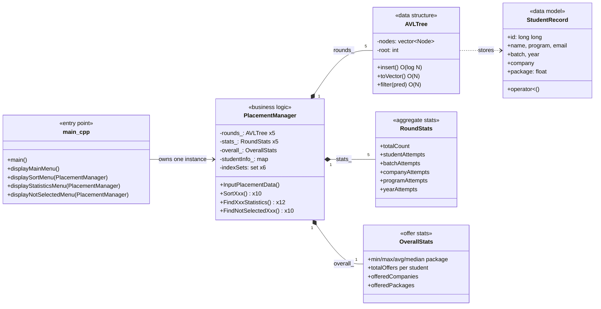
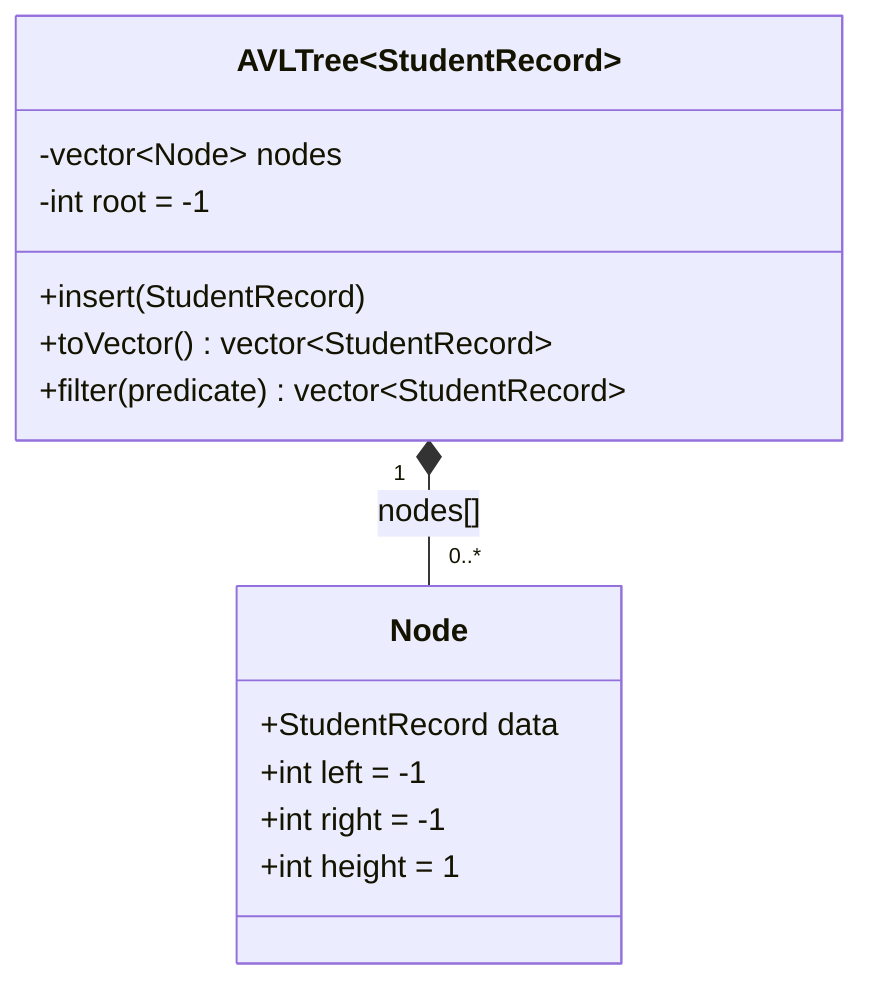
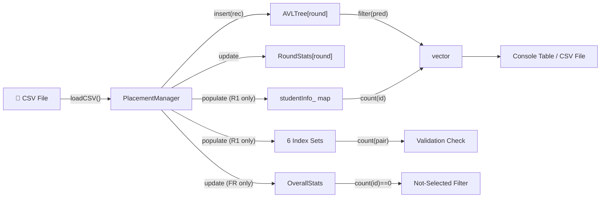

# Class Diagram — DAIICT Placement Manager

> Full UML class diagram showing all classes, structs, enums, relationships, and their attributes and methods.

---

## Complete Class Diagram

```mermaid
classDiagram
    direction TB

    %% ─────────────────────────────────────────────
    %%  ENUMS
    %% ─────────────────────────────────────────────
    class Round {
        <<enumeration>>
        ROUND_1 = 0
        ROUND_2 = 1
        ROUND_3 = 2
        ROUND_4 = 3
        FINAL_ROUND = 4
        NUM_ROUNDS = 5
    }

    %% ─────────────────────────────────────────────
    %%  CORE DATA STRUCTURES
    %% ─────────────────────────────────────────────
    class StudentRecord {
        +long long id
        +string name
        +int batch
        +string program
        +string email
        +long long contactNO
        +long long whatsappNO
        +string company
        +int year
        +float package
        +bool operator<(StudentRecord o) const
    }

    class RoundStats {
        +int totalCount
        +unordered_map~long_long_int~ studentAttempts
        +unordered_map~long_long_vec_string~ studentCompanies
        +unordered_map~int_int~ batchAttempts
        +unordered_map~string_int~ companyAttempts
        +unordered_map~string_int~ programAttempts
        +unordered_map~int_int~ yearAttempts
    }

    class OverallStats {
        +float minPackage
        +float maxPackage
        +float totalPackage
        +float avgPackage
        +vector~float~ allPackages
        +vector~string~ companiesVisited
        +unordered_map~long_long_int~ totalOffers
        +unordered_map~long_long_vec_string~ offeredCompanies
        +unordered_map~long_long_vec_float~ offeredPackages
        +unordered_map~int_int~ batchOffers
        +unordered_map~string_int~ programOffers
        +unordered_map~string_int~ companyOffers
        +unordered_map~int_int~ yearOffers
    }

    %% ─────────────────────────────────────────────
    %%  AVL TREE
    %% ─────────────────────────────────────────────
    class AVLTree~T~ {
        -vector~Node~ nodes
        -int root
        -int getHeight(int i)
        -void updateHeight(int i)
        -int getBalance(int i)
        -int rotateRight(int y)
        -int rotateLeft(int x)
        -int insertAt(int i, T data)
        -void inorderAt(int i, vector~T~ out) const
        -void filterAt(int i, predicate, vector~T~ out) const
        +AVLTree()
        +void reserve(int n)
        +void insert(T data)
        +vector~T~ toVector() const
        +vector~T~ filter(predicate) const
        +bool empty() const
        +int size() const
    }

    class Node {
        +T data
        +int left
        +int right
        +int height
        +Node(T d)
    }

    %% ─────────────────────────────────────────────
    %%  PLACEMENT MANAGER
    %% ─────────────────────────────────────────────
    class PlacementManager {
        -vector~AVLTree_StudentRecord~ rounds_
        -unordered_map~long_long_StudentRecord~ studentInfo_
        -vector~RoundStats~ stats_
        -OverallStats overall_
        -set~pair_int_string~ batchCompanyIdx_
        -set~pair_int_string~ batchProgramIdx_
        -set~pair_string_string~ programCompanyIdx_
        -set~pair_int_int~ yearBatchIdx_
        -set~pair_int_string~ yearProgramIdx_
        -set~pair_int_string~ yearCompanyIdx_
        -void printHLine(int width, char fill) const
        -void printTableHeader(bool showPackage) const
        -void printTableRow(StudentRecord r, bool showPackage) const
        -void printTable(vector~StudentRecord~ data, bool showPackage) const
        -void writeCSV(string path, vector~StudentRecord~ data, bool showPackage) const
        -vector~StudentRecord~ filter(Round r, predicate) const
        -vector~StudentRecord~ notSelected(predicate) const
        -void askDisplayWrite(vector~StudentRecord~ data, bool showPackage, string header) const
        -Round askRound() const
        -void insertSorted(Round r, StudentRecord rec)
        -void loadCSV(string path, string company, Round r)
        -float computeMedian(vector~float~ nums) const
        -void printPackageStats(vector~StudentRecord~ offered, int r1Attempts) const
        -bool isDataLoaded() const
        -bool batchExists(int batch) const
        -bool programExists(string p) const
        -bool companyExists(string c) const
        -bool yearExists(int year) const
        -bool batchCompanyExists(int batch, string company) const
        -bool batchProgramExists(int batch, string program) const
        -bool programCompanyExists(string p, string c) const
        -bool yearBatchExists(int year, int batch) const
        -bool yearProgramExists(int year, string program) const
        -bool yearCompanyExists(int year, string company) const
        +PlacementManager()
        +void InputPlacementData()
        +void SortWholeData()
        +void SortDataBatchWise()
        +void SortDataProgramWise()
        +void SortDataYearWise()
        +void SortDataCompanyWise()
        +void SortDataBatchAndCompanyWise()
        +void SortDataProgramOFBatchWise()
        +void SortDataProgramOFCompanyWise()
        +void SortDataProgramOFYearWise()
        +void SortDataYearAndBatchWise()
        +void FindOverallPlacementStatistics()
        +void FindStudentPlacementDetails()
        +void FindBatchWisePlacementStatistics()
        +void FindProgramWisePlacementStatistics()
        +void FindCompanyWisePlacementStatistics()
        +void FindYearWisePlacementStatistics()
        +void FindBatchAndCompanyWisePlacementStatistics()
        +void FindProgramAndBatchWisePlacementStatistics()
        +void FindProgramAndCompanyWisePlacementStatistics()
        +void FindYearAndBatchWisePlacementStatistics()
        +void FindYearAndCompanyWisePlacementStatistics()
        +void FindYearAndProgramWisePlacementStatistics()
        +void FindNotSelectedBatchWise()
        +void FindNotSelectedProgramWise()
        +void FindNotSelectedCompanyWise()
        +void FindNotSelectedYearWise()
        +void FindNotSelectedBatchAndProgramWise()
        +void FindNotSelectedBatchAndCompanyWise()
        +void FindNotSelectedCompanyAndProgramWise()
        +void FindNotSelectedYearAndBatchWise()
        +void FindNotSelectedYearAndProgramWise()
        +void FindNotSelectedYearAndCompanyWise()
    }

    %% ─────────────────────────────────────────────
    %%  RELATIONSHIPS
    %% ─────────────────────────────────────────────
    AVLTree~T~ *-- Node : contains (inner struct)
    PlacementManager *-- AVLTree~T~ : contains 5 (rounds_)
    PlacementManager *-- RoundStats : contains 5 (stats_)
    PlacementManager *-- OverallStats : contains 1 (overall_)
    PlacementManager ..> StudentRecord : creates and stores
    AVLTree~T~ ..> StudentRecord : parameterized with
    StudentRecord ..> Round : used by
    PlacementManager ..> Round : uses (enum)
```

---

## Simplified Class Relationship Diagram

For a cleaner overview of key relationships:

---

## AVLTree Internal Node Structure

**Note:** `left` and `right` in `Node` are **integer indices** into the `nodes` vector, not pointers. `-1` represents null (no child). This design avoids per-node heap allocation and keeps all nodes in a single contiguous memory block.

---

## Data Flow Between Classes

---

## Inheritance and Template Instantiation

The project uses **no inheritance** (no class hierarchy). The only polymorphism is through:

1. **Templates** — `AVLTree<T>` is instantiated as `AVLTree<StudentRecord>` throughout
2. **`std::function<bool(const T&)>`** — used as the predicate type for `filter()` and `notSelected()`, allowing different lambda closures to be passed at each call site

This keeps the design simple, flat, and cache-efficient.
