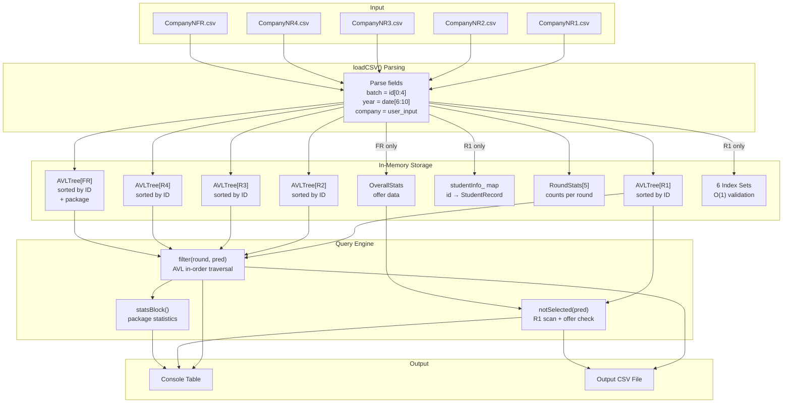

# Data Flow & CSV Format — DAIICT Placement Manager

> This document specifies the CSV input format, describes how data flows through the system, and explains all field derivations and parsing logic.

---

## Table of Contents

- [CSV File Organization](#csv-file-organization)
- [CSV Format Specification](#csv-format-specification)
  - [Round 1–4 Format (R1, R2, R3, R4)](#round-14-format-r1-r2-r3-r4)
  - [Final Round Format (FR)](#final-round-format-fr)
  - [Output CSV Format](#output-csv-format)
- [Data Ingestion Pipeline](#data-ingestion-pipeline)
- [Field Derivation Rules](#field-derivation-rules)
- [ID Format and Encoding](#id-format-and-encoding)
- [Programs Reference](#programs-reference)
- [Sample Data](#sample-data)
- [Data Validation Behavior](#data-validation-behavior)
- [End-to-End Data Flow Diagram](#end-to-end-data-flow-diagram)

---

## CSV File Organization

The `data/` directory contains **25 CSV files** following the naming convention:

```
data/
├── CompanyNR1.csv    → Round 1 data for Company N (N = 1..5)
├── CompanyNR2.csv    → Round 2 data
├── CompanyNR3.csv    → Round 3 data
├── CompanyNR4.csv    → Round 4 data
└── CompanyNFR.csv    → Final Round data (includes package)
```

**Naming pattern:** `Company{N}{Round}.csv`
- `{N}` = Company number (1-5 in the sample dataset)
- `{Round}` = `R1`, `R2`, `R3`, `R4`, `FR`

**Important:** The system is **not tied to this naming convention** — when loading data, the user provides the file path manually. The company name is entered separately as a string. Any CSV files following the format spec will work regardless of name.

---

## CSV Format Specification

### Round 1–4 Format (R1, R2, R3, R4)

**8 columns:**

| Column | Header | Type | Example | Notes |
|---|---|---|---|---|
| 1 | `Sr.No` | int | `1` | Serial number, skipped during parsing |
| 2 | `Student ID` | long long | `202101126` | 9-digit unique student identifier |
| 3 | `Name` | string | `Dhanuk Garde` | Full name, may contain spaces |
| 4 | `Program` | string | `Btech ICT-CS` | Degree program |
| 5 | `Interview Date` | string | `01-04-2023` | Format: `DD-MM-YYYY` |
| 6 | `Email` | string | `202101126@daiict.ac.in` | Institute email |
| 7 | `Contact No` | long long | `2859914207` | Contact number (10 digits) |
| 8 | `WhatsApp No` | long long | `8423114879` | WhatsApp number (10 digits) |

**Sample header row:**
```
Sr.No,Student ID,Name,Program,Interview Date,Email,Contact No,WhatsApp No
```

**Sample data row:**
```
8,202101126,Dhanuk Garde,Btech ICT-CS,01-04-2023,202101126@daiict.ac.in,2859914207,8423114879
```

---

### Final Round Format (FR)

**9 columns** (same as R1–R4, plus `Package` column):

| Column | Header | Type | Example | Notes |
|---|---|---|---|---|
| 1 | `Sr. No.` | int | `1` | Skipped |
| 2 | `Student ID` | long long | `202101126` | |
| 3 | `Name` | string | `Dhanuk Garde` | |
| 4 | `Program` | string | `Btech ICT-CS` | |
| 5 | `Interview Date` | string | `20-05-2023` | |
| 6 | `Email` | string | `202101126@daiict.ac.in` | |
| 7 | `Contact No` | long long | `2859914207` | |
| 8 | `WhatsApp No` | long long | `8423114879` | |
| 9 | `Package` | float | `15.5` | **Salary in LPA (Lakhs Per Annum)** |

**Sample header row:**
```
Sr. No.,Student ID,Name,Program,Interview Date,Email,Contact No,WhatsApp No,Package
```

**Sample data row:**
```
20,202101126,Dhanuk Garde,Btech ICT-CS,20-05-2023,202101126@daiict.ac.in,2859914207,8423114879,15.5
```

> **Note:** The `package` field in the `StudentRecord` struct is initialized to `0.0f` for all non-Final-Round records. It is only set to a meaningful value when `r == FINAL_ROUND`.

---

### Output CSV Format

When the user requests data export, the system writes a CSV file with:

**Non-Final Round output (9 columns):**
```
Sr.no,ID,Name,Batch,Program,Email,Contact No,WhatsApp No,Company,Year
1,202101126,Dhanuk Garde,2021,Btech ICT-CS,202101126@daiict.ac.in,2859914207,8423114879,Company1,2023
```

**Final Round output (10 columns, adds Package):**
```
Sr.no,ID,Name,Batch,Program,Email,Contact No,WhatsApp No,Company,Package,Year
20,202101126,Dhanuk Garde,2021,Btech ICT-CS,202101126@daiict.ac.in,2859914207,8423114879,Company1,15.5,2023
```

**Key differences between input and output CSV:**
- Output adds `Batch` and `Year` columns (derived during parsing)
- Output adds `Company` column (supplied by user when loading)
- Output adds a sequential `Sr.no` column
- Output does NOT include the `Interview Date` column
- Output includes `Package` only for Final Round queries

---

## Data Ingestion Pipeline

```
User provides: company_name, [path_R1, path_R2, path_R3, path_R4, path_FR]

For each (path, round):
│
├── 1. Open file (ifstream)
│   └── Error if not found → print message, return
│
├── 2. Skip header row (getline)
│
├── 3. For each subsequent line:
│   │
│   ├── 3a. Parse CSV fields using istringstream + getline(ss, field, ',')
│   │   Fields parsed in order:
│   │   skip → id_str → name → program → date_str → email → cno_str → wno_str
│   │   [if FINAL_ROUND]: → pkg_str
│   │
│   ├── 3b. Type conversions:
│   │   rec.id         = stoll(id_str)
│   │   rec.batch      = stoi(id_str.substr(0, 4))     ← first 4 chars
│   │   rec.year       = stoi(date_str.substr(6, 4))   ← chars 6-9 of "DD-MM-YYYY"
│   │   rec.contactNO  = stoll(cno_str)
│   │   rec.whatsappNO = stoll(wno_str)
│   │   rec.package    = stof(pkg_str)  [FINAL_ROUND only]
│   │
│   ├── 3c. rec.company = company_name (set from user input)
│   │
│   ├── 3d. insertSorted(round, rec) → AVLTree::insert()
│   │
│   └── 3e. Update stats_ and index structures (see Architecture.md)
│
└── 4. Close file
```

---

## Field Derivation Rules

### Batch (Admission Year)

```cpp
rec.batch = stoi(id_str.substr(0, 4));
```

The student ID follows the format `YYYYNNNNN` where:
- `YYYY` = admission year (4 digits)
- `NNNNN` = enrollment number (5 digits)

**Examples:**
| ID | Batch |
|---|---|
| `202101126` | `2021` |
| `202001197` | `2020` |
| `202301290` | `2023` |
| `201901676` | `2019` |

**Multi-batch support:** The system handles multiple batches in the same dataset. Students from 2019, 2020, 2021, 2022, and 2023 batches all coexist.

---

### Year (Interview Year)

```cpp
rec.year = stoi(date_str.substr(6, 4));
```

The `Interview Date` column is formatted as `DD-MM-YYYY`. The year is extracted starting at index 6:

```
"01-04-2023"
 0123456789
       ^^^^
       index 6, length 4 → "2023"
```

**Year is not the same as Batch:**
- `batch` = when the student was admitted (e.g., 2021)
- `year` = when the interview took place (e.g., 2023)

A batch-2021 student may interview in 2023 (their 3rd year).

---

### Company

```cpp
rec.company = company;  // Set from user-provided company name
```

The CSV files do **not** contain a company column — the company name is provided by the user when calling `InputPlacementData()` and is attached to every record parsed from that company's files.

---

## ID Format and Encoding

The student ID is a **9-digit long long integer** that encodes:

```
┌─────────────────────────────────────────────────────┐
│  Student ID: 2 0 2 1 0 1 1 2 6                      │
│              └──┬──┘ └──┬──┘                        │
│             Batch(2021) Enrollment(01126)            │
└─────────────────────────────────────────────────────┘
```

The `operator<` on `StudentRecord` compares by ID, so the AVL tree stores records in order of: batch first (older students lower), then enrollment number within the same batch.

---

## Programs Reference

The following program codes appear in the dataset:

| Code | Full Name | Level |
|---|---|---|
| `Btech ICT` | Bachelor of Technology in Information and Communication Technology | Undergraduate |
| `Btech ICT-CS` | Bachelor of Technology in ICT with Minor in Computational Science | Undergraduate |
| `Btech MnC` | Bachelor of Technology in Mathematics and Computing | Undergraduate |
| `Mtech ICT` | Master of Technology in Information and Communication Technology | Postgraduate |
| `Mtech ICT-CS` | Master of Technology in ICT with Minor in Computational Science | Postgraduate |
| `Mtech MnC` | Master of Technology in Mathematics and Computing | Postgraduate |

---

## Sample Data

### Round 1 Sample (first 5 rows from Company1R1.csv)

| Sr.No | Student ID | Name | Program | Interview Date | Email | Contact No | WhatsApp No |
|---|---|---|---|---|---|---|---|
| 1 | 202001197 | Reyansh Batta | Btech ICT-CS | 02-04-2023 | 202001197@daiict.ac.in | 6067937047 | 1588717566 |
| 2 | 202001151 | Tejas Walia | Mtech ICT-CS | 01-04-2023 | 202001151@daiict.ac.in | 9194036873 | 5070621862 |
| 3 | 202101660 | Raunak Viswanathan | Btech ICT | 01-04-2023 | 202101660@daiict.ac.in | 3317574695 | 1514745264 |
| 4 | 202301290 | Yuvaan Bajwa | Mtech MnC | 03-04-2023 | 202301290@daiict.ac.in | 2903594338 | 9453282674 |
| 5 | 202301176 | Jivika Sani | Mtech MnC | 01-04-2023 | 202301176@daiict.ac.in | 3728681170 | 4219391734 |

**After parsing, each row becomes a `StudentRecord`:**
```
StudentRecord {
  id: 202001197, name: "Reyansh Batta",
  batch: 2020,   program: "Btech ICT-CS",
  email: "202001197@daiict.ac.in",
  contactNO: 6067937047, whatsappNO: 1588717566,
  company: "Company1", year: 2023,
  package: 0.0f  ← not a final round record
}
```

### Final Round Sample (first 5 rows from Company1FR.csv)

| Sr.No | Student ID | Name | Program | Interview Date | Email | Contact No | WhatsApp No | Package |
|---|---|---|---|---|---|---|---|---|
| 1 | 202201195 | Jiya Kumar | Btech MnC | 20-05-2023 | ... | 5642514012 | 9754447254 | 9.0 |
| 4 | 202101111 | Urvi Sridhar | Mtech ICT | 18-05-2023 | ... | 3803406008 | 6543622607 | 13.5 |
| 7 | 202101181 | Keya Edwin | Mtech MnC | 20-05-2023 | ... | 3974962011 | 7859988140 | 17.5 |
| 19 | 202301145 | Divit Sarna | Mtech ICT | 20-05-2023 | ... | 7110892543 | 2458385433 | 19.5 |
| 20 | 202101126 | Dhanuk Garde | Btech ICT-CS | 20-05-2023 | ... | 2859914207 | 8423114879 | 15.5 |

---

## Data Validation Behavior

| Scenario | System Response |
|---|---|
| File path doesn't exist | Error message, skip this round's load |
| Empty line in CSV | `continue` — skipped |
| Duplicate student ID in same round | Record is overwritten (AVL duplicate handling) |
| Student in multiple rounds | Separate records in each round's tree; stats updated per round |
| Student appears in multiple companies | Each company's data loaded as separate call to `InputPlacementData()` |
| Student in Final Round → gets offer | Added to `overall_.totalOffers`; used for not-selected detection |
| Student NOT in Final Round | Not in `overall_.totalOffers`; counted as "not selected" |

---

## End-to-End Data Flow Diagram


