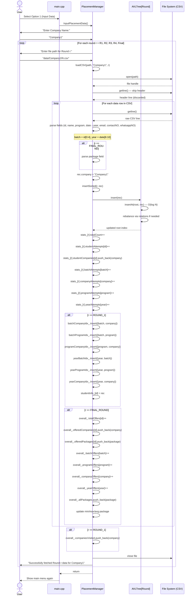
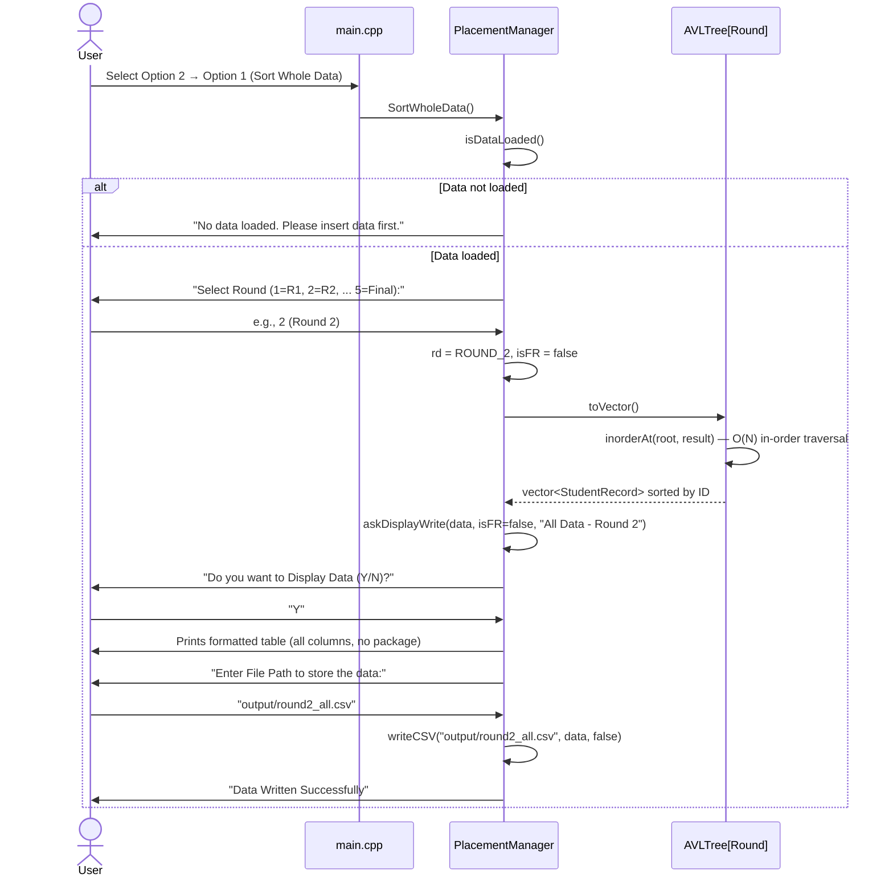
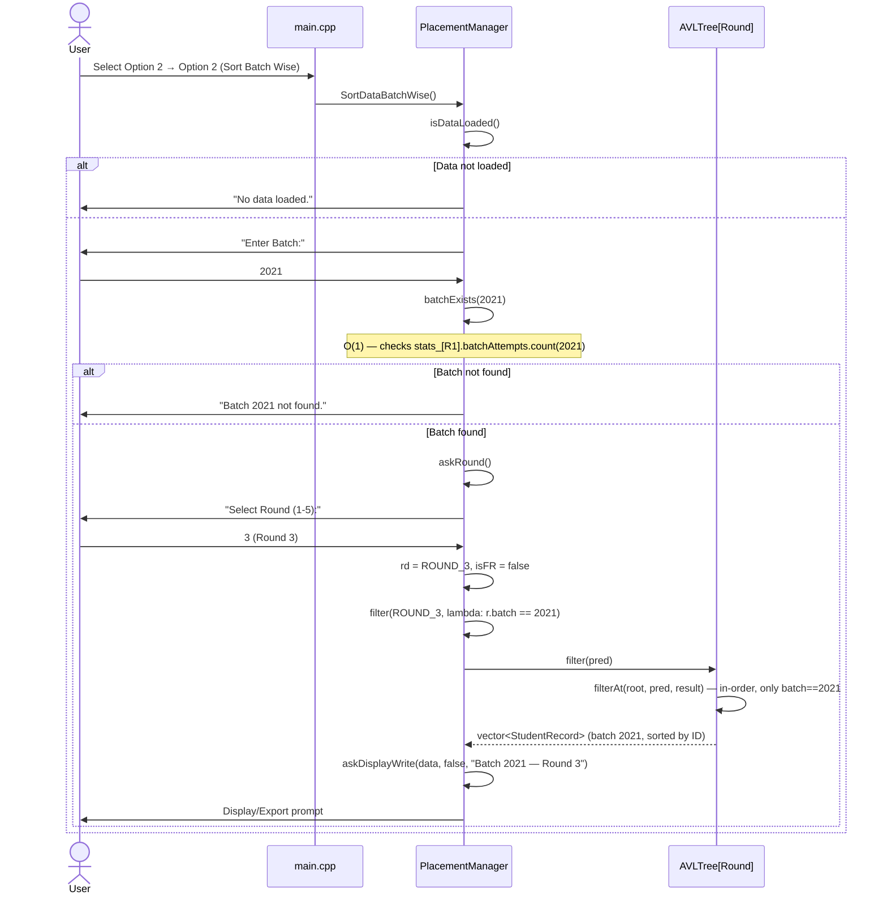
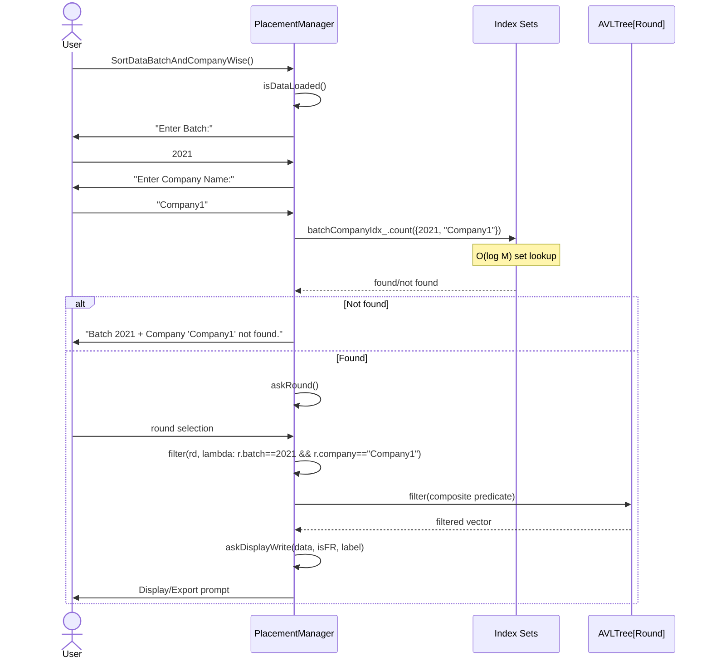
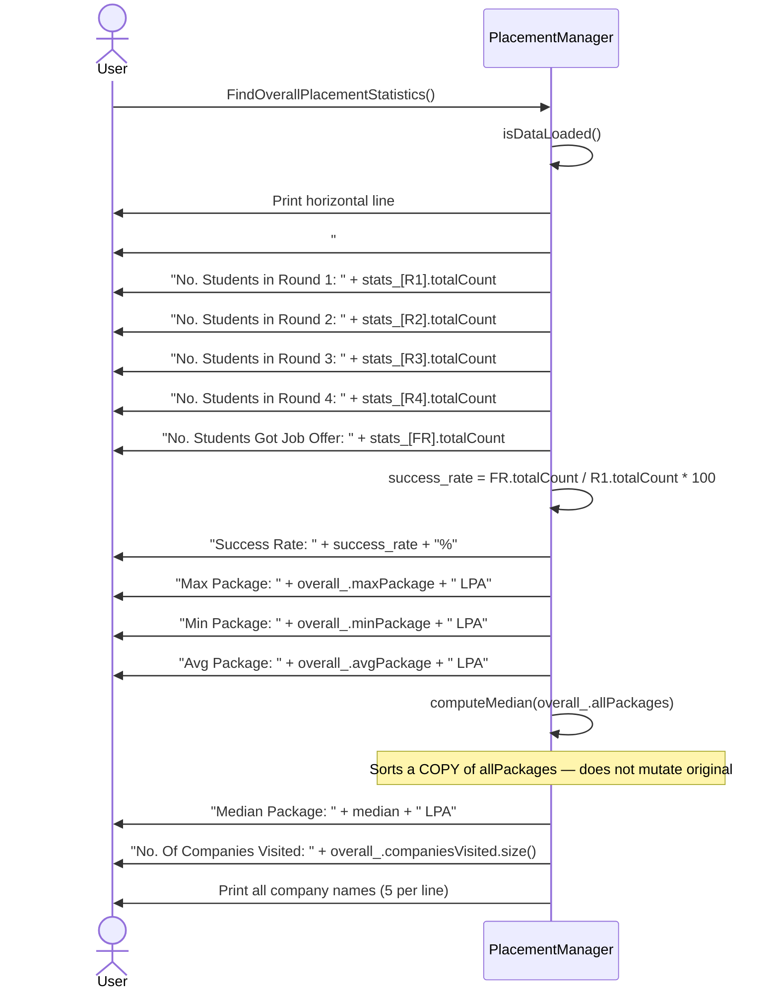
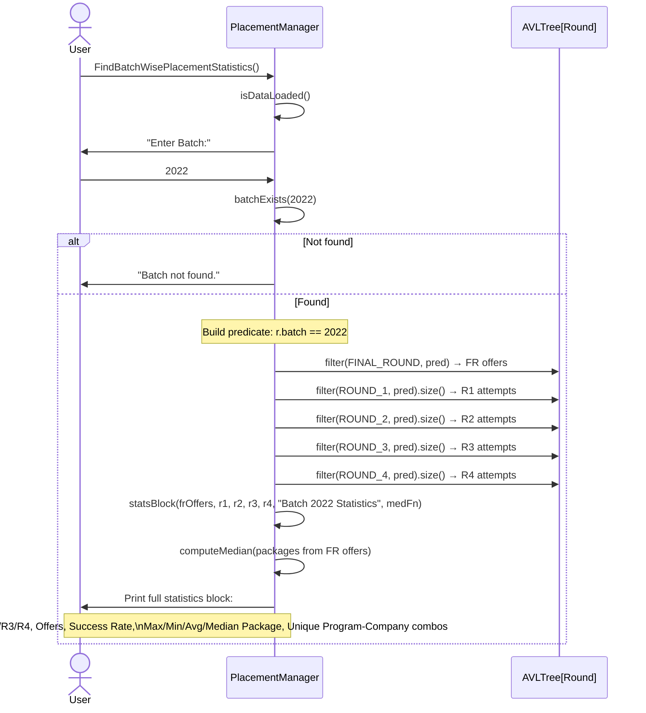
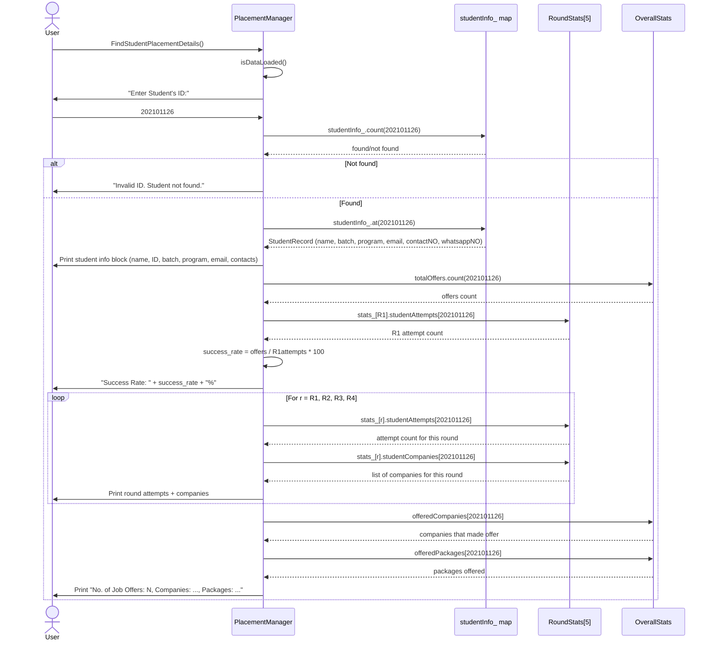
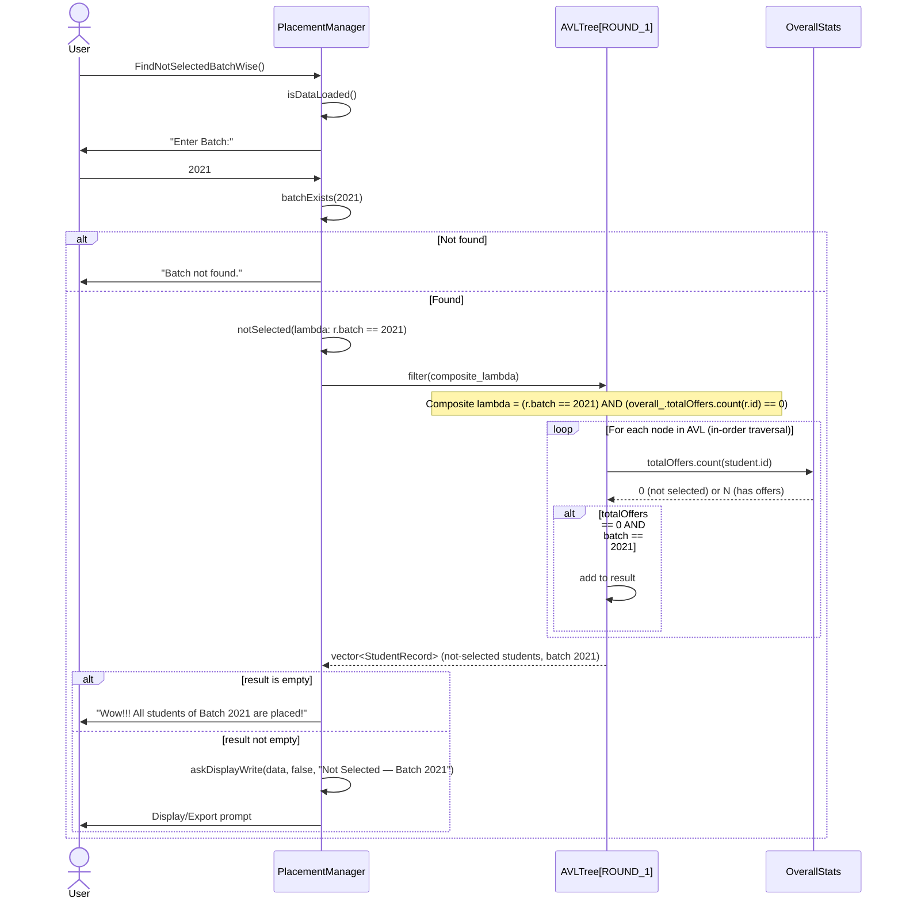
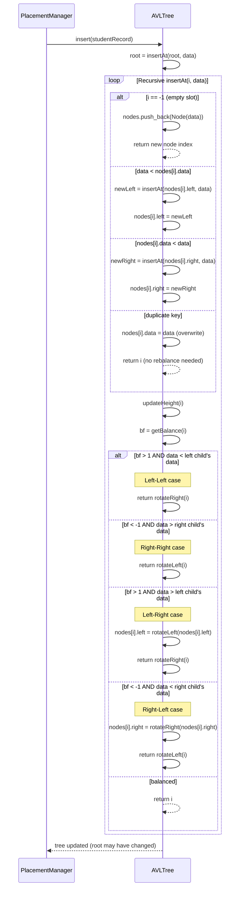

# Sequence Diagrams — DAIICT Placement Manager

> Sequence diagrams showing the exact call flow for all major modules: Data Loading, Sort/Display/Export, Placement Statistics, and Not-Selected Students.

---

## Table of Contents

- [Module 1: Data Input Flow](#module-1-data-input-flow)
- [Module 2: Sort / Display / Export Flow](#module-2-sort--display--export-flow)
  - [Sort Whole Data](#21-sort-whole-data)
  - [Sort with Single Filter (e.g., Batch Wise)](#22-sort-with-single-filter-eg-batch-wise)
  - [Sort with Composite Filter (e.g., Batch + Company)](#23-sort-with-composite-filter-eg-batch--company)
- [Module 3: Placement Statistics Flow](#module-3-placement-statistics-flow)
  - [Overall Statistics](#31-overall-statistics)
  - [Batch-Wise Statistics](#32-batch-wise-statistics)
  - [Student Placement Details](#33-student-placement-details)
- [Module 4: Not-Selected Students Flow](#module-4-not-selected-students-flow)
- [Module 5: AVL Tree Insert Flow](#module-5-avl-tree-insert-flow)

---

## Module 1: Data Input Flow

This flow is triggered when the user selects **Menu Option 1 → Input Placement Data**.



---

## Module 2: Sort / Display / Export Flow

### 2.1 Sort Whole Data

Simplest sort — no filter criterion, just select round.



---

### 2.2 Sort with Single Filter (e.g., Batch Wise)

Pattern used by: `SortDataBatchWise`, `SortDataProgramWise`, `SortDataYearWise`, `SortDataCompanyWise`.



---

### 2.3 Sort with Composite Filter (e.g., Batch + Company)

Pattern used by: `SortDataBatchAndCompanyWise`, `SortDataProgramOFBatchWise`, etc.



---

## Module 3: Placement Statistics Flow

### 3.1 Overall Statistics



---

### 3.2 Batch-Wise Statistics

Pattern used by all statistics methods except Overall and Student Details.



---

### 3.3 Student Placement Details



---

## Module 4: Not-Selected Students Flow

Pattern shared by all 10 `FindNotSelectedXxx()` methods.



---

## Module 5: AVL Tree Insert Flow

Detailed view of what happens when `insertSorted()` is called.



---

## Summary: Method Call Patterns

All 32 public methods share one of **4 common call patterns**:

### Pattern A — Sort/Export with No Filter
```
SortWholeData()
  └── isDataLoaded() → askRound() → toVector() → askDisplayWrite()
```

### Pattern B — Sort/Export with Single Filter
```
SortDataBatchWise() / SortDataProgramWise() / SortDataYearWise() / SortDataCompanyWise()
  └── isDataLoaded() → get criterion → validateXxx() → askRound() → filter(lambda) → askDisplayWrite()
```

### Pattern C — Sort/Export with Composite Filter
```
SortDataBatchAndCompanyWise() / SortDataProgramOFBatchWise() / ...
  └── isDataLoaded() → get 2 criteria → validateComposite() → askRound() → filter(composite lambda) → askDisplayWrite()
```

### Pattern D — Statistics
```
FindXxxWisePlacementStatistics()
  └── isDataLoaded() → get criterion → validate() → filter(FR, pred) + filter(R1..R4, pred).size() → statsBlock()
```

### Pattern E — Not Selected
```
FindNotSelectedXxx()
  └── isDataLoaded() → get criterion → validate() → notSelected(lambda) → askDisplayWrite() or "All placed!" message
```
